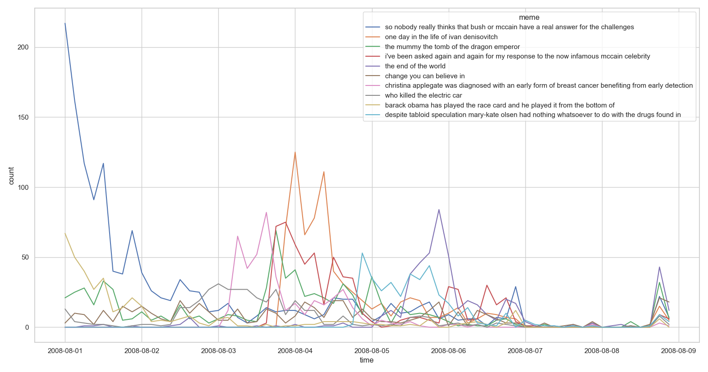
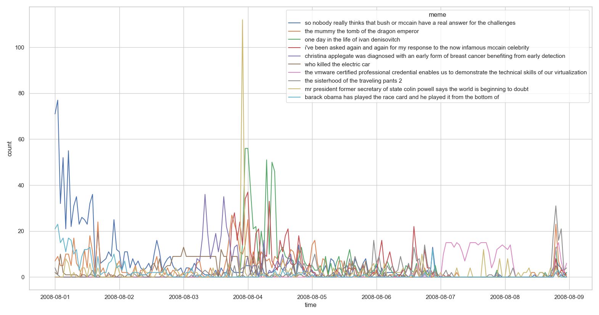
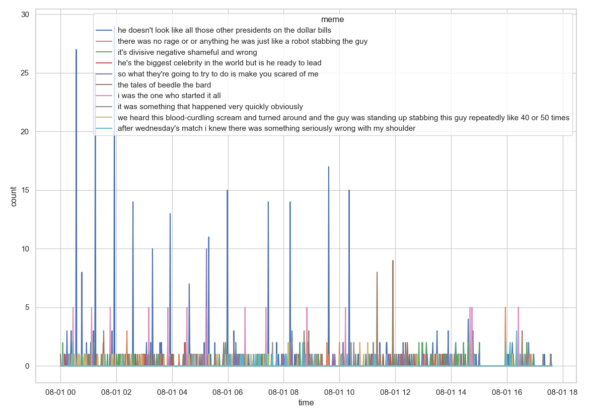

# Memetracker 
-----------------------------
partial realization in python of [1]                                   
                              
[1] Leskovec, Jure, Lars Backstrom, and Jon Kleinberg. “Meme-Tracking and the Dynamics of the News Cycle.” In Proceedings of the 15th ACM SIGKDD International Conference on Knowledge Discovery and Data Mining - KDD ’09, 497. Paris, France: ACM Press, 2009. https://doi.org/10.1145/1557019.1557077.                       

-------------------------
# Outputs                 
                   
             
             
               
